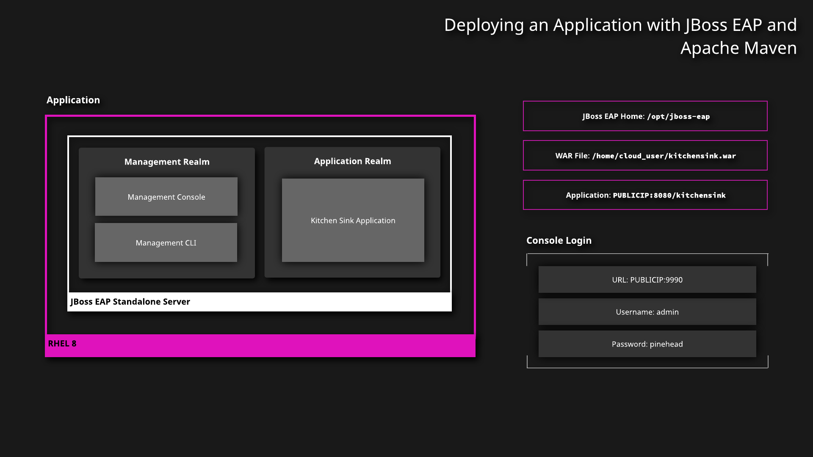

<h1 align="center">Deploying an Application with JBoss EAP and Apache Maven</h1>

## Diagram 



## :white_check_mark: Install Apache Maven

Install Maven using 
```
sudo yum install maven.
```
## :white_check_mark: Deploy the Application
1. Move into the `kitchensink` directory:
```
cd kitchensink
```
2. Review the contents. It contains a `pom.xml` file for building and deploying the project in Maven. The project itself is stored in the `src` directory, along with tests.
```
ls
```
3. Deploy the application:
```
sudo mvn clean install wildfly:deploy
```
Visit `PUBLICIP:8080/kitchensink` to ensure the application is working.

## :white_check_mark: Make a Change to the Application
1. Undeploy the application:

```
mvn wildfly:undeploy
```
2. Make a superficial change to the application:
```
vim src/main/webapp/WEB-INF/templates/default.xhtml
```
3. Update the title to add a change:
```
<title>Add a change!</title>
```
## :white_check_mark: Redeploy the Application
1. Deploy the application once more; notice how much faster it deploys this time:
```
sudo mvn clean install wildfly:deploy
```
2. Visit the application and take note of your change.

<h1 align="center">Deploying an Application with the JBoss EAP Management CLI</h1>

## :white_check_mark: Connect to the CLI

1. In the cloud_user's home directory, confirm the presence of the `kitchensink.war` file:

```
ls
```
2. Move into the JBoss home directory:

```
cd /opt/jboss-eap
```

3. Open the JBoss Management CLI:

```
sudo ./bin/jboss-cli.sh
```

4. Connect to the server:

```
connect
```
## :white_check_mark: Deploy the Application

1. Deploy the application:

```
deployment deploy-file /home/cloud_user/kitchensink.war
```

2. Check that the application has deployed using the deployment info command:

```
deployment info
```

3. Finally, access PUBLICIP:8080/kitchensink to access the application itself.

## :white_check_mark: Disable/Undeploy the Application

1. Now that you know the application is working, you can either disable it or undeploy it entirely:

```
deployment disable kitchensink.war
deployment undeploy kitchensink.war
```

2. Exit the CLI:

```
exit
```